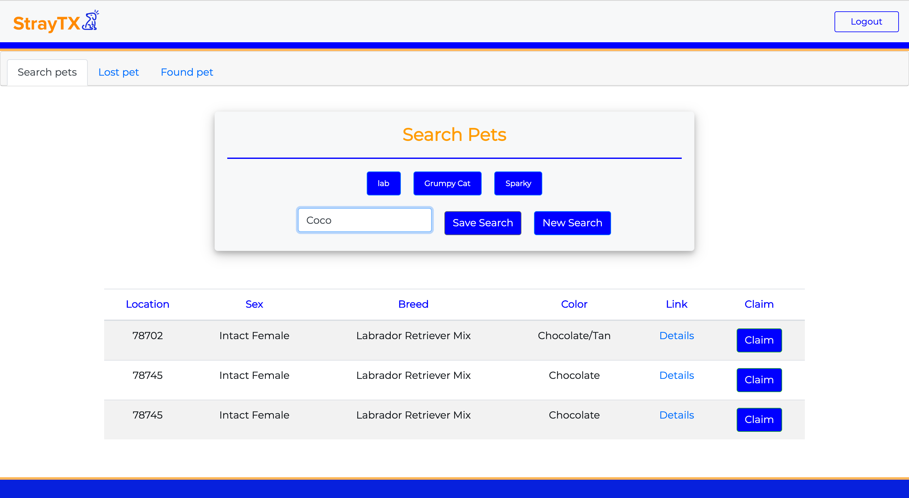

"strayTX" is a website designed around user-friendliness and information to help pet owners submit a lost pet or find their pet that may be contained in our database. Built around the Austin Animal Center and PetHarbor database, we were able to develop a website that can take in any missing pets in the Austin area. The user is given a location of where it was found as well as the pets biological information and a link to an image of said pet that is hosted on PetHarbors website. 

## Functionality

Compared to our com-pet-itors, "strayTX" focuses on usability. From the login, to searching our database, and when submitting a new pet, users will find it easy to navigate our website. 

Once a user has created an account or logged in they can search our database for their lost pet.

Then have the option to save their searches as well that appears as buttons for an easy search again. 

Lastly, the user has an option to submit a new pet that they have lost or if they would like to submit a pet that they have found but is no theirs, they can submit a "found" pet so that the original owner may see it appear in our database. 

